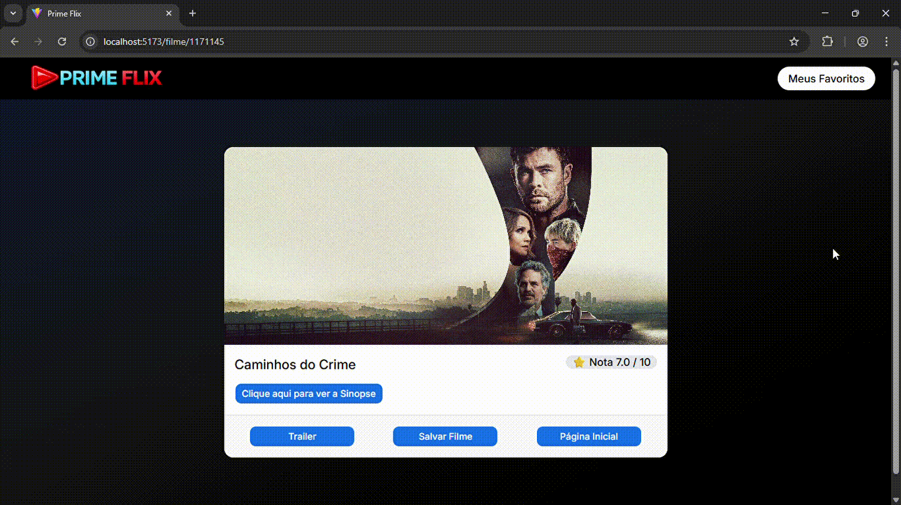
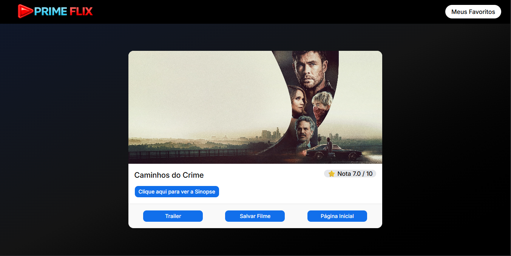
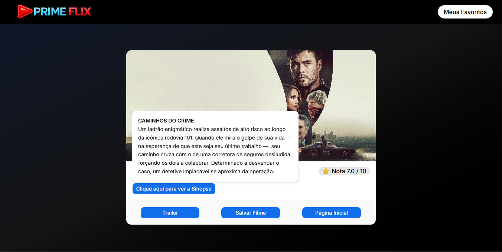

# 🎬 PrimeFlix

<p align="center">
  
  
  
  
  
  
</p>

<p align="center">
  Aplicação moderna para descoberta de filmes, com foco em performance, UI elegante e experiência do usuário.
</p>

---

## 🚀 Demonstração

🔗 _Adicione aqui o link do deploy (Vercel / Netlify)_

---

## 📖 Sobre o projeto

O **PrimeFlix** é uma aplicação web desenvolvida para exploração de filmes, com foco em performance, usabilidade e boas práticas de desenvolvimento frontend.

A ideia principal é entregar uma experiência fluida, com interface moderna e responsiva, permitindo que o usuário:

- 🎬 Visualize detalhes completos
- ❤️ Salve seus filmes favoritos
- 📱 Utilize em qualquer dispositivo

---

## ✨ Features

- 🎞️ Listagem de filmes populares
- 📄 Página de detalhes completa
- ⭐ Sistema de favoritos com persistência
- 🔔 Feedback visual com toast
- 📱 Layout totalmente responsivo
- ⚡ Carregamento rápido com Vite

---

## 🛠️ Tecnologias

| Tecnologia       | Descrição                          |
| ---------------- | ---------------------------------- |
| React.js         | Biblioteca principal para UI       |
| Vite             | Build tool moderna e rápida        |
| TailwindCSS      | Estilização utilitária             |
| Shadcn UI        | Componentes acessíveis e elegantes |
| React Router DOM | Navegação entre páginas            |
| Axios            | Requisições HTTP                   |
| LocalStorage     | Persistência de dados              |

---

## 🧱 Arquitetura

```bash
src/
├── components/       # Componentes reutilizáveis
├── pages/            # Páginas principais
├── service/          # Configuração da API
├── hooks/            # Hooks customizados
├── assets/           # Arquivos estáticos
└── App.tsx           # Root da aplicação
```

---

## 📡 Integração com API

A aplicação consome dados da API do **TMDb**, incluindo:

- Filmes populares
- Detalhes de filmes
- Filtro por região

---

## 💾 Persistência

Os dados de favoritos são armazenados via:

```bash
localStorage
```

Garantindo que o usuário não perca seus filmes salvos.

---

## 📸 Preview

### 🎬 Remoção de favoritos
<p align="center">
    
</p>

### ❤️ Adição aos favoritos e validação de duplicados
<p align="center">
    
</p>

### 📄 Tela de detalhes do filme
<p align="center">
    
</p>

### 💬 Popover com sinopse do filme
<p align="center">
    
</p>

---

## ⚙️ Como rodar o projeto

```bash
# Clone o repositório
git clone https://github.com/seu-usuario/primeflix

# Entre na pasta
cd primeflix

# Instale as dependências
npm install

# Execute o projeto
npm run dev
```

---

## 🔐 Variáveis de ambiente

Crie um arquivo `.env`:

```env
VITE_API_KEY=YOUR_API_KEY
```

---

## 🚧 Roadmap (Melhorias futuras)

- 🔐 Autenticação de usuários
- 🎥 Player de trailer integrado
- ⭐ Sistema de avaliação
- 🌍 Filtro por múltiplas regiões
- 🔎 Paginação/infinite scroll

---

## 🧠 Aprendizados

Este projeto reforçou conhecimentos em:

- Consumo de APIs REST
- Gerenciamento de estado no React
- Componentização escalável
- UI/UX com Tailwind e Shadcn
- Boas práticas de organização

---

## 🤝 Contribuição

Contribuições são bem-vindas!

```bash
# Fork
# Crie uma branch
git checkout -b feature/minha-feature

# Commit
git commit -m "feat: minha feature"

# Push
git push origin feature/minha-feature
```

Abra um Pull Request 🚀

---

## 📄 Licença

Este projeto está sob a licença MIT.

---

## 👨‍💻 Autor

Feito por **Jonatas Gomes**

Este projeto foi desenvolvido com o objetivo de consolidar conhecimentos em desenvolvimento frontend, consumo de APIs REST e construção de interfaces modernas com foco em experiência do usuário.

---

<p align="center">
  ⭐ Se curtiu o projeto, não esquece de dar uma estrela!
</p>
